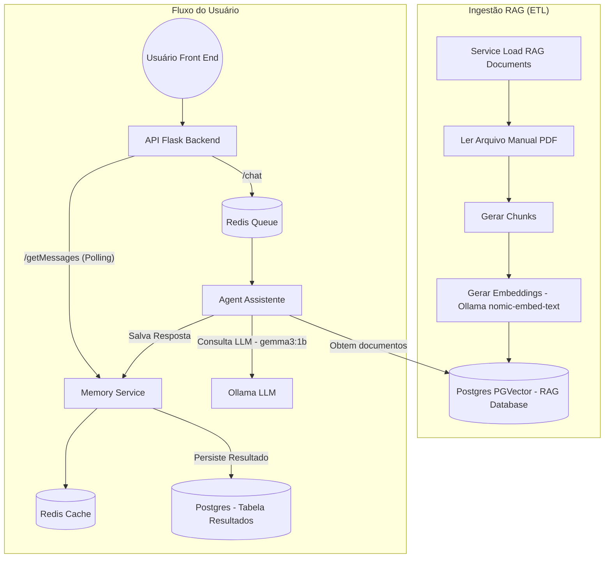

# 🧊 Assistente Especialista em Geladeiras (RAG)

Este projeto implementa um agente conversacional inteligente para suporte técnico de geladeiras Panasonic, utilizando uma arquitetura de microserviços assíncronos e processamento RAG de alta fidelidade.

## 🏗️ Arquitetura do Sistema

Abaixo, o diagrama técnico que descreve o fluxo de dados desde a ingestão do manual até a resposta ao usuário final (baseado em [arquitetura.png](file:///Users/pablosls/Desktop/testes/antigravity/arquitura_agente/arquitetura.png)):



### Componentes de Arquitetura:
- **API Flask Backend**: Ponto de entrada que gerencia as requisições `/chat` e o polling `/getMessages`.
- **Redis Queue**: Fila de mensagens para garantir que o processamento do LLM não bloqueie a interface.
- **Agent Assistente**: O núcleo de inteligência que orquestra a recuperação vetorial e a geração de resposta.
- **Memory Service**: Módulo responsável pela gestão de estado, salvando o histórico no **Postgres** (permanente) e no **Redis** (cache de alta performance).
- **Service Load RAG Documents**: Pipeline de pré-processamento que transforma o manual bruto em conhecimento vetorial.

## 🚀 Tecnologias Utilizadas

- **Linguagem**: Python 3.10
- **Framework Web**: Flask
- **Banco de Dados**: PostgreSQL com extensão `pgvector`
- **Mensageria e Cache**: Redis
- **IA/LLM**: Ollama (gemma3:1b, nomic-embed-text)
- **OCR**: Docling (IBM)
- **Orquestração**: Docker Compose

## 🛠️ Configuração e Instalação

### Pré-requisitos
1. **Ollama instalado nativamente no Mac/Host**:
   - Baixe em [ollama.com](https://ollama.com)
   - Certifique-se que o serviço está rodando na porta `11434`.
2. **Docker e Docker Compose**.

### Passos para Rodar (Passo a Passo)

1. **Configurar o Ambiente Virtual Python**:
   ```bash
   python3 -m venv .venv
   source .venv/bin/activate
   ```

2. **Instalar Dependências**:
   ```bash
   pip install -r requirements.txt
   ```

3. **Extração Base via OCR (Opcional)**:
   Se houver um novo manual, gere um novo extrato rodando o script:
   ```bash
   python extract_docling_images.py
   ```

4. **Subir a Infraestrutura**:
   ```bash
   docker compose up --build -d
   ```

5. **Acessar as Aplicações**:
   - **Frontend do Agente (Chat)**: [http://localhost:5005](http://localhost:5005)
   - **Gerenciamento de Fila (RedisInsight)**: [http://localhost:5540](http://localhost:5540)
   - **Gerenciamento de Banco (pgAdmin 4)**: [http://localhost:8081](http://localhost:8081)
     - **Login**: `admin@admin.com` / **Senha**: `admin`
     - **Configuração Servidor**: Host: `postgres` | User: `user` | Pass: `password` | DB: `agent_db`

## ⚡ Cache e Performance

O sistema utiliza uma estratégia de **Cache Híbrido**:
- Quando o worker gera uma resposta, ela é salva no **Postgres** (durabilidade) e no **Redis** (velocidade).
- Consultas sucessivas ao histórico de chat (`/getMessages`) são servidas diretamente pelo Redis (**Cache HIT**), eliminando a latência do banco de dados e do processamento de modelos.

## 🧪 Validação de Precisão

O agente carrega **regras estritas no System Prompt** para evitar alucinações:
1. Responde **apenas** com base no contexto fornecido (RAG).
2. Se a informação não estiver no manual, responde: *"Não encontrei a informação solicitada no manual."*

---
> [!IMPORTANT]
> **Aceleração Local**: O worker utiliza `host.docker.internal` para acessar o Ollama no Mac host, permitindo o uso total de GPU/Metal para inferências rápidas.
 original.
- `docker-compose.yml`: Orquestração completa dos serviços.

---