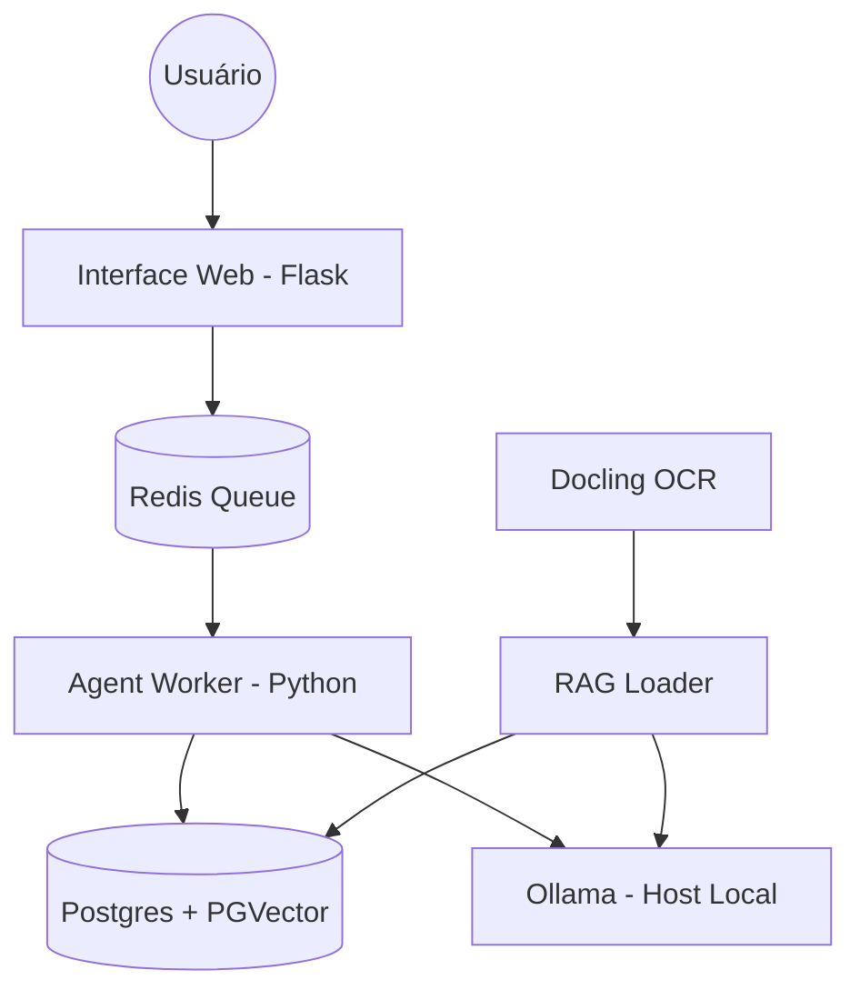

# 🧊 Assistente Especialista em Geladeiras (RAG)

Este projeto implementa um agente conversacional inteligente capaz de responder dúvidas técnicas sobre o manual de geladeiras (especificamente modelos Panasonic). Utiliza uma arquitetura RAG (Retrieval-Augmented Generation) robusta com processamento assíncrono e ingestão de dados via OCR de alta fidelidade.

## 🏗️ Arquitetura do Sistema

O projeto é baseado em microserviços orquestrados via Docker Compose, garantindo escalabilidade e isolamento de componentes.



### Componentes Principais:
- **Flask API**: Interface de chat e endpoint de mensagens.
- **Redis**: Fila de mensagens para processamento assíncrono das respostas.
- **Agent Worker**: Core do assistente que recupera contexto e gera respostas usando LLM.
- **PostgreSQL + PGVector**: Armazenamento vetorial para busca semântica e histórico.
- **Ollama**: Servidor de modelos local (Nomic Embeddings + Gemma:2b).
- **Docling OCR**: Pipeline de extração de texto a partir de imagens do manual para garantir 100% de fidelidade.

## 🚀 Tecnologias Utilizadas

- **Linguagem**: Python 3.10
- **Framework Web**: Flask
- **Banco de Dados**: PostgreSQL com extensão `pgvector`
- **Mensageria**: Redis
- **IA/LLM**: Ollama (gemma:2b, nomic-embed-text)
- **OCR**: Docling (IBM)
- **Orquestração**: Docker Compose

## 🛠️ Configuração e Instalação

### Pré-requisitos
1. **Ollama instalado nativamente no Mac/Host**:
   - Baixe em [ollama.com](https://ollama.com)
   - Certifique-se que o serviço está rodando na porta `11434`.
2. **Docker e Docker Compose**.

### Passos para Rodar (Passo a Passo)

1. **Configurar o Ambiente Virtual Python**:
   Recomendamos criar um ambiente isolado (virtual environment) em sua máquina local para instalar as dependências de Extração de Imagens (Docling) tranquilamente:
   ```bash
   python3 -m venv .venv
   source .venv/bin/activate
   ```

2. **Instalar Dependências**:
   Instale todas as bibliotecas requeridas na raiz do projeto (inclui Docling, Flask, Langchain, etc):
   ```bash
   pip install -r requirements.txt
   ```

3. **Extração Base via OCR (Opcional)**:
   Se houver um novo manual ou imagens PDF em `/ilovepdf_pages-to-jpg`, gere um novo extrato rodando o script isolado do `docling` fora do Docker (suporta aceleração num ambiente local):
   ```bash
   python extract_docling_images.py
   ```
   Isso fará o overwrite do `geladeira_images_extracted.json`.

4. **Subir a Infraestrutura RAG**:
   Com o JSON pronto, instancie os workers (Redis, Postgres, Flask, Agent) diretamente pelo docker compose. Este comando empacota sua arquitetura em background de forma veloz:
   ```bash
   docker compose up --build -d
   ```

5. **Ingestão de Vetores (Automática)**:
   Sempre que os containers subirem, o serviço temporário `rag_loader` será o primeiro a ser acionado. Ele vai:
   - Limpar o banco de vetores histórico.
   - Ler o `geladeira_images_extracted.json`.
   - Calcular 35 embeddings chamando seu Ollama local.
   - Guardar permanentemente os dados limpos no PGVector PostgreSQL.

6. **Acessar as Aplicações**:
   - **Frontend do Agente (Chat)**: [http://localhost:5005](http://localhost:5005)
   - **Interface do Fio de Eventos (RedisInsight)**: [http://localhost:5540](http://localhost:5540)
   - **Interface do Banco de Dados (pgAdmin 4)**: [http://localhost:8081](http://localhost:8081)
     - **Login**: `admin@admin.com` / **Senha**: `admin`
     - **Conexão com Postgres**:
       - *Host*: `postgres`
       - *Database*: `agent_db`
       - *Username*: `user`
       - *Password*: `password`

## 🧪 Validação e Testes

O projeto conta com um script de validação rigoroso (`rag_validation.py`) que testa a precisão do assistente com 10 perguntas do manual:
- **Pergunta**: *"Quantos bips o alarme soa após a porta ficar aberta por três minutos?"*
- **Resposta Esperada**: 4 bips.
- **Status local**: ✅ Validado com sucesso.

Os resultados das últimas baterias de testes podem ser encontrados nos arquivos:
- `rag_evaluation_imgs.md`
- `final_chat_response_1774818433808.png` (Screenshot do Teste)

## 📁 Estrutura de Arquivos

- `src/api.py`: Servidor Flask.
- `src/agent.py`: Worker assíncrono do assistente.
- `src/rag_loader.py`: Script de ETL e Ingestão de vetores.
- `extract_docling_images.py`: Script de OCR para processamento do manual original.
- `docker-compose.yml`: Orquestração completa dos serviços.

---
> [!IMPORTANT]
> **Nota sobre Performance**: O worker está configurado para usar o Ollama nativo via `host.docker.internal` para aproveitar a aceleração de hardware (GPU/Metal) do seu Mac, garantindo respostas em tempo real.
# agente_suporte
